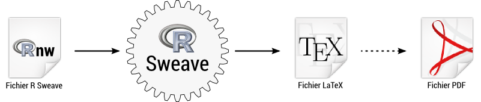
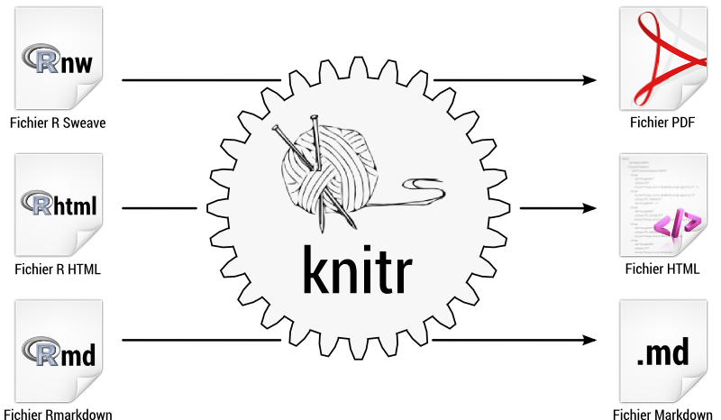
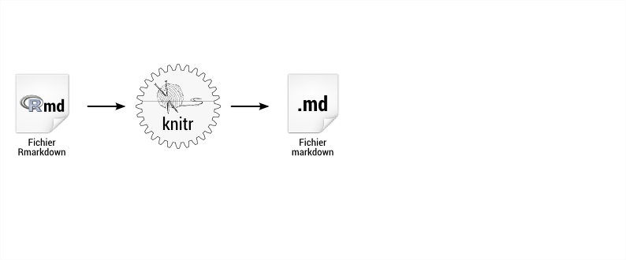
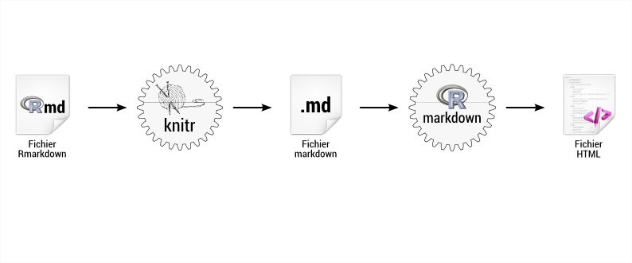
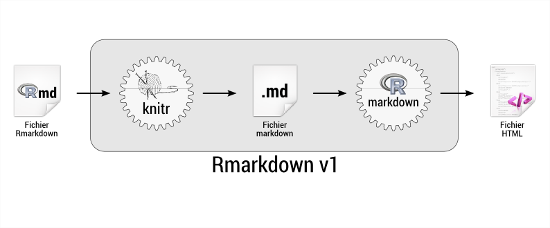
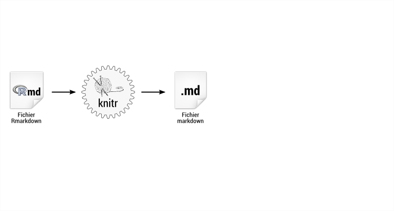
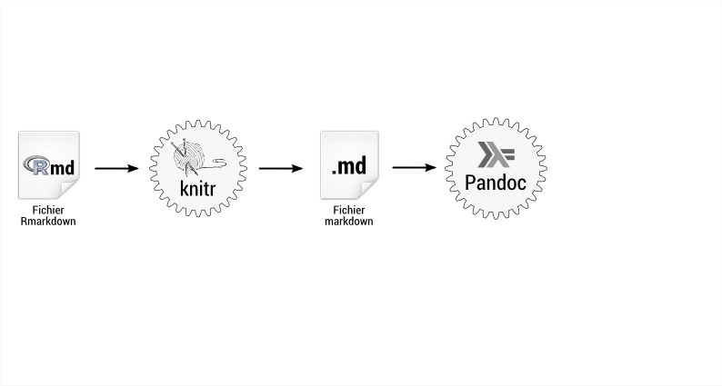
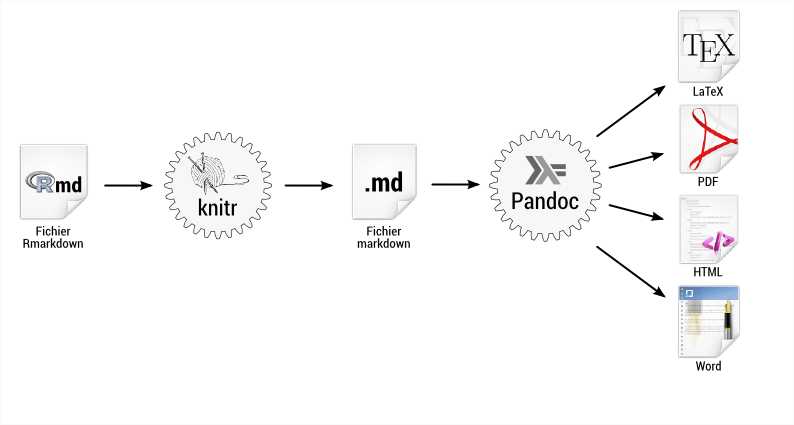
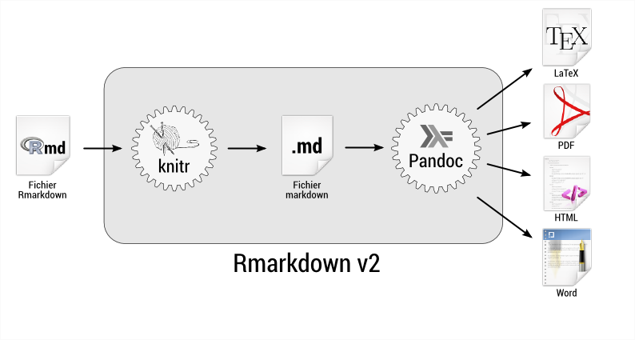

```{r init,echo=FALSE}
library(knitr)

```

# Un peu d'histoire


## Au commencement était Donald Knuth {.flexbox .vcenter}

<div class="center">

</div>

## Le premier jour, Donald knuth créa le *literate programming* {.flexbox .vcenter}

<div class="center">

</div>


## Le deuxième jour, Friedrich Leisch créa Sweave  {.flexbox .vcenter}

<div class="center">

</div>

## Le troisième jour, Yihui Xie créa knitr {.flexbox .vcenter}

<div class="center">

</div>

## Le quatrième jour, RStudio créa Rmarkdown (v1) {.flexbox .vcenter}

<div class="center">

</div>

## Le quatrième jour, RStudio créa Rmarkdown (v1) {.flexbox .vcenter}

<div class="center">

</div>

## Le quatrième jour, RStudio créa Rmarkdown (v1) {.flexbox .vcenter}

<div class="center">

</div>

## Le cinquième jour, RStudio créa Rmarkdown v2 {.flexbox .vcenter}

<div class="center">

</div>

## Le cinquième jour, RStudio créa Rmarkdown v2 {.flexbox .vcenter}

<div class="center">

</div>

## Le cinquième jour, RStudio créa Rmarkdown v2 {.flexbox .vcenter}

<div class="center">

</div>

## Le cinquième jour, RStudio créa Rmarkdown v2 {.flexbox .vcenter}

<div class="center">

</div>


# Principes de base

## Prérequis

### Dans RStudio
Tout est préinstallé.


### En dehors de RStudio

- Extension `rmarkdown` (et ses dépendances)
- `pandoc`

### Dans tous les cas

- Pour générer du PDF : une installation fonctionnelle de $\mathrm{\LaTeX{}}$
(MikTeX, MacTeX, TeX live...).


## Markdown ?

<div style="width:45%; float: left;">
### Source
```
Voici du texte en **gras** 
et en *italique*.

### Un titre

On peut aussi mettre un
[lien](http://r-project.org)
ou même une image

```
</div>

<div style="width:45%; padding-left: 5%; float: right; border-left:1px solid #AAA;">
### Rendu
Voici du texte en **gras** et en *italique*.

### Un titre

On peut aussi mettre un
[lien](http://r-project.org)
ou même une image


<p style="font-size: 9px; clear: both;">Image © [Jan Ka](https://500px.com/photo/89423839/what-by-jan-ka)</p>
</div>


## Markdown ?

Plus d'infos sur la version de Markdown utilisée par RMarkdown :

- *Markdown Quick Reference* dans l'aide de RStudio
- En ligne sur le site de RStudio : http://rmarkdown.rstudio.com/authoring_pandoc_markdown.html
- En ligne sur le site de Pandoc : http://johnmacfarlane.net/pandoc/README.html#pandocs-markdown


## RMarkdown ?

<div style="width:45%; float: left;">
### Source
```
Du code merveilleux...

‵‵‵{r}
print("Meow")
‵‵‵

...suivi d'une analyse
passionnante.

```
</div>

<div style="width:45%; padding-left: 5%; float: left;">
### Rendu
Du code merveilleux...

```{r}
print("Meow")
```

...suivi d'une analyse passionnante.

</div>

## RMarkdown ?

<div style="width:45%; float: left;">
### Source
```
Une image *à couper le 
souffle* :

‵‵‵{r}
library(ggplot2)
qplot(mtcars$mpg)
‵‵‵

```
</div>

<div style="width:45%; padding-left: 5%; float: left;">
### Rendu

Une image *à couper le souffle* :

```{r fig.width=3, fig.height=3, message=FALSE}
library(ggplot2)
qplot(mtcars$mpg)
```

</div>

## RMarkdown

Deux types de blocs de code :

### En bloc

```
‵‵‵{r}
print(nrow(mtcars))
‵‵‵
```

### En ligne

```
Le tableau a ‵r nrow(mtcars)‵ lignes.
```

## Compilation du document

### Sous RStudio

- Boutons `Knit HTML`, `Knit PDF`...

### Script ou console

- Fonction `render()` (de `rmarkdown`).


# Configuration et<br /> personnalisation

## Configuration

Il y a deux types de configuration :

- Configuration du rendu du document : `rmarkdown`
- Configuration du rendu des blocs de code : `knitr`

## Configuration niveau document

La configuration de `rmarkdown` se fait dans un en-tête au format YAML :

```
---
title: "Un zouli titre"
author: "Machin Bidule"
date: "18/11/2014"
output: html_document
---
```

Elle permet de définir :

- les métadonnées du document
- le format du document à générer
- des options propres à chaque format


## Configuration niveau blocs de code

Les options de `knitr` permettent de modifier le comportement des blocs de code.

### Par bloc

```
‵‵‵{r nom_du_bloc, echo=FALSE, cache=TRUE}
print(nrow(mtcars))
‵‵‵
```

### Pour l'ensemble des blocs

```
‵‵‵{r}
opts_chunk$set(echo=FALSE)
‵‵‵
```

## Possibilités de rendu d'autres objets

### Tableaux

Fonction `kable()` de `knitr`

### Équations

Syntaxe $\mathrm{\LaTeX{}}$, rendue selon le format de sortie (natif, Mathjax...)

### Bibliographie

RMarkdown lit les bases de références selon différents formats (BibTeX, EndNote...) 
et gère les citations et la génération de la bibliographie (HTML, PDF, Word).


## Types de documents et templates

Il est possible de personnaliser l'apparence du document généré :

- en déclarant un document avec des styles de référence (Word)
- en utilisant une CSS personnalisée (HTML)
- en incluant des fichiers en en-têtes, pied de page (HTML et PDF)

On peut également utiliser des formats et des *templates* distribués avec `rmarkdown` ou fournis par d'autres extensions :

- template `tufte_handout`
- templates de différentes revues (extension `rticles`)
- templates HTML (extension `rmdformats`)

## Slides

Possibilités de générer des slides selon le même principe.

- format `beamer` (PDF)
- format `slidy` (HTML)
- format `ioslides` (HTML)

Nombreuses options spécifiques.

## Possibilités "avancées"

- Faire un site Web statique ou avec un moteur de blog type Jekyll
- Graphiques interactifs avec `ggvis` (HTML, RStudio ou Shiny server)
- Documents dynamiques et interactifs avec `shiny` (HTML, RStudio ou Shiny server)


## Avantages / inconvénients

### Avantages
- Avantages de Sweave : mise à jour, reproductibilité...
- Un format d'entrée, plusieurs formats de sortie
- Syntaxe Markdown facile à utiliser et mémoriser
- Développement dynamique
- Documentation très complète (en anglais)

### Inconvénients
- Encore jeune, quelques bugs
- Difficile de personnaliser la présentation en gardant de multiples formats de sortie
- Beaucoup d'options, à la fois pour `rmarkdown` et pour `knitr`


## En savoir plus

Tout est là :
http://rmarkdown.rstudio.com/

Et notamment l'antisèche (*cheat sheet*) (PDF, 2 pages) :
http://rmarkdown.rstudio.com/RMarkdownCheatSheet.pdf

Et le guide de référence (PDF, 3 pages) :
http://rmarkdown.rstudio.com/RMarkdownReferenceGuide.pdf

Site de `knitr` :
http://yihui.name/knitr/

Site de `pandoc` :
http://johnmacfarlane.net/pandoc/


